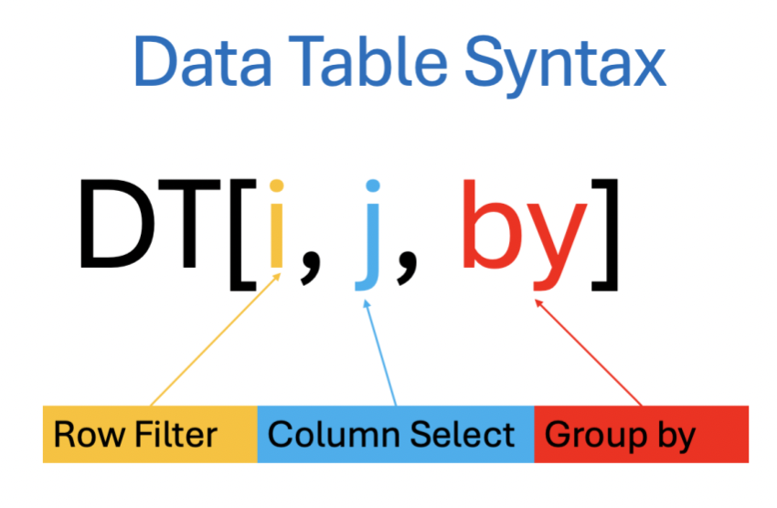
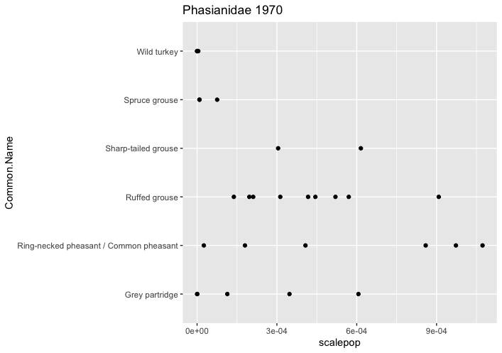
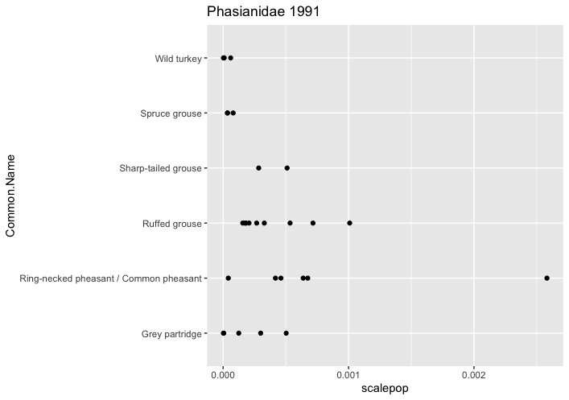
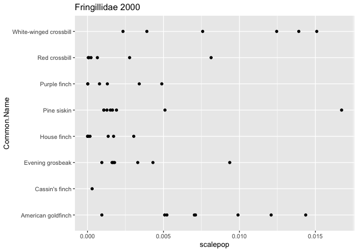

# Welcome to my R Coding Club tutorial on Advanced Package Literacy in `R`!


# Tutorial Aim:
The aim of this content is to equip users with the knowledge and skills to efficiently manipulate and analyze data in `R` using both the `data.table` and `purrr` packages. This includes mastering high-performance data manipulation with `data.table` (e.g., importing, filtering, and transforming data) and streamlining workflows with `purrr`'s functional programming tools (e.g., iteration, mapping, and handling nested data).

# Tutorial Content
### [1. Introduction](#1-introduction)
### [2. High-Performance data manipulation using `data.table`](#2-high-performance-data-manipulation-using-datatable)
- [a. Introduction to `data.table`](#2a-introduction-to-datatable)
- [b. Importing data using `data.table`](#2b-importing-data-using-datatable)
- [c. Converting `data.frame` to `data.table`](#2c-converting-dataframe-to-datatable)
- [d. Filtering rows based on conditions](#2d-filtering-rows-based-on-conditions)
- [e. How to select multiple columns using a character vector](#2f-how-to-select-multiple-columns-using-a-character-vector)
- [f. How to drop columns](#2g-how-to-drop-columns)
- [g. How to rename columns](#2h-how-to-rename-columns)
- [h. Creating a new column from existing columns](#2i-creating-a-new-column-from-existing-columns)
- [i. Grouping](#2j-grouping)
### [3. Efficient workflows with `purrr`](#3-efficient-workflows-with-purrr)
- [a. Introduction to `purrr`](#3a-introduction-to-purrr)
- [b. Map functions: Easier iteration in `R`](#3b-map-functions-easier-iteration-in-r)
- [c. Simplest usage: Repeated looping with map](#3c-simplest-usage-repeated-looping-with-map)
- [d. The tilde-dot shorthand for functions and tidying](#3d-the-tilde-dot-shorthand-for-functions-and-tidying)
- [e. Maps with multiple input objects](#3e-maps-with-multiple-input-objects)
- [f. List columns and nested data frames](#3f-list-columns-and-nested-data-frames)
- [g. Nesting the LPI data](#3g-nesting-the-lpi-data)

---

You can get all of the resources for this tutorial from <a href="https://github.com/EdDataScienceEES/tutorial-jackegriffin.git">this GitHub repository</a>. Clone and download the repo as a zip file, then unzip it.

---

### 1. Introduction

---

`R` is an incredibly powerful tool, but let's face it—the true magic of `R` lies in the rich ecosystem of packages available. Think of each `R` package as a specialized toolbox, with each one tailored for specific tasks.

From wrangling messy data sets to building beautiful visualisations or running complex statistical models, there is likely a package that can make your life easier. Yet, from this, we can become susceptible to something called **package fatigue** (I may coin this term as my own). With a wide range of choices comes an uncertainty as to what to use.

Alas, this tutorial is here to help you navigate some of the less-used packages to help you build confidence and get to grips with the package world of `R`.

The `tidyverse` is a widely used and powerful set of `R` packages designed for data analysis, but it is not without its drawbacks. One of the main concerns with the `tidyverse` is its performance on very large datasets. Since `tidyverse` packages like dplyr process data in memory, they can struggle when working with datasets that exceed the available memory. This can lead to slow performance compared to alternatives like `data.table`, which is optimized for speed and memory efficiency. Furthermore, the common tidyverse syntax can occasionally be a little confusing and cumbersome.

In this tutorial, you will be introduced to two packages you may not have used at all: `data.table` and `purrr`. Both of these, when mastered, can be extremely efficient and tidy. But the main point of this tutorial is to encourage you to not feel intimidated by package names you don't recognize or functions you don't know. Instead of being daunted by them, we can learn about them and incorporate them into our workflows. It can take as little as one hour to better understand and use what was once an unrecognizable and intimidating package name. By doing so, we’ll begin to see the crazy world of `R` as a much more tangible and accessible space.

So, let's make a start and start thinking about packages we may have not even heard of. Open `RStudio`, clone into the GitHub repository and create a new script by clicking on `File/ New File/ R Script` set the working directory and we are ready to go. 

Today we will be using data from the **Living Planet Index** which is free, open source data and is a key indicator used to measure the state of global biodiversity. Information regarding the Living Planet Index's licensing policy can be found in the GitHub repositories **README**. Other data we will be using will be imported from the web, or directly from an `R` package itself.

---

### 2. High-performance data manipulation using `data.table`

---

#### 2(a). Introduction to `data.table`

`data.table` is a package designed to handle large datasets quickly and efficiently, using minimal memory. It allows you to filter, summarize, and transform data all within the same framework. Unlike `dplyr`, `data.table` modifies the data directly in memory, which means it doesn’t need to create duplicate copies of the data. You don’t need to worry about that too much, though. What’s important is that `data.table` is known for its speed, especially when working with large tables or summarizing data quickly.

So, follow along with this tutorial and code to better understand `data.table`

First, let us load our libraries
```
# Loading libraries ----
library(tidyverse)
install.packages("palmerpenguins")
library(palmerpenguins)
```
It’s a good idea to use `install.packages() to get the latest version of data.table from CRAN. However, if you want to access the latest development version, you can also install it from GitHub.
```
# Install using CRAN
install.packages(data.table)

# Install Dev version from GitHub
install.packages("data.table", repos="https://Rdatatable.gitlab.io/data.table")
data.table::update.dev.pkg()

# Don't worry if this doesn't work, you can revert back to the CRAN version of data.table using:
remove.packages("data.table")
install.packages("data.table")
library(data.table)
```

#### 2(b). Importing data using `data.table`

Working with data.tables is a bit different from working with data.frames. Before diving into the package, it's important to understand these differences.

The `fread()` function (short for "fast read") is the `data.table` equivalent of `read.csv()`. Like `read.csv()`, it can read files from your local computer or from the internet. However, it’s at least 20 times faster, which is especially helpful when working with large datasets (millions of rows).

Run the code below to see how fast `fread()` is. It will create a CSV file with 1 million rows and then read it back, printing the time taken by both `fread()` and `read.csv()` in the console.
```
# Create a large .csv file
set.seed(100)
m <- data.frame(matrix(runif(10000000), nrow=10000000))
write.csv(m, 'm2.csv', row.names = F)

# Time taken for read.csv to import
system.time({m_df <- read.csv('m2.csv')})
# Your time may be different to mine
#> user system  elapsed
#> 8.636  0.120 43.003

# Time taken by fread to import
system.time({m_dt <- fread('m2.csv')})
# Again, your time may be different to mine, but you should see much quicker speeds
#> user system  elapsed
#> 0.217  0.018 0.067
# For my times, that's around at least 40x faster. Big difference
```
**IMPORTANT**: Do not attempt to open the m2.csv or push it to github as it will crash your session - it is a very large dataset and trust me, I know this from experience...

Let's import some data based on forest fires using `fread()` to get some practice
```
ff <- fread("https://archive.ics.uci.edu/ml/machine-learning-databases/forest-fires/forestfires.csv")
head(ff)
class(ff)
```
When you import data with `fread()`, it is stored directly as a `data.table`. As shown by the `class(ff)` output, a `data.table` inherits from the `data.frame` class, meaning it is also a `data.frame`. This means you can use any functions that normally work on a `data.frame` with a `data.table` as well. Since the dataset we imported was relatively small, the speed of `read.csv()` was sufficient.

#### 2(c). Converting `data.frame` to `data.table`

You can convert any `data.frame` into `data.table` using any one of these two approaches:
1. `data.table(df)` or `as.data.table(df)`, where `(df)` is your chosen data frame
2. `setDT(df)`  

The difference between these two approaches is that `data.table(df)` will create a copy of `(df)` and convert it to a `data.table`, whereas `setDT(df)` converts it to a `data.table` and fully replaces it (converts it inplace, if you will).
Now we will work with some great penguin data from `R`'s `palmerpenguins` package.


```
# Lets load a default dataframe from R's default datasets package and palmerpenguins package
data(penguins)
```
Note: the `data.table()` has no rownames, and so if the `data.frame` does have rownames, these must be stored in a separate column before converting to `data.table`.
So, our `penguins` data has no rownames, but purely for example's sake, we can create rownames before going forward.
Normally, you may not need to do this to the `penguins` data, and we could instead use a dataframe that already has rownames such as `mtcars`, but we like to keep the ecological context.
```
rownames(penguins) <- paste(penguins$species, 1:nrow(penguins))
head(penguins)

# Now lets store these row names as a separate column
penguins$penguinid <- rownames(penguins)
rm(trees)

# Now we can convert to data.table using one of the methods we mentioned earlier
penguins_dt <- as.data.table(penguins)
class(penguins_dt)

# Alternatively we can use setDT() to convert it inplace
penguins_copy <- copy(penguins)
setDT(penguins_copy)
class(penguins_copy)

# Conversely, we can convert a data.table back to a data.frame using as.data.frame(dt) or setDF(dt)
setDF(penguins_copy)
class(penguins_copy)
```
And vice versa, and vice versa...

#### 2(d). Filtering rows based on conditions

The key difference between a `data.frame` and a `data.table` is that `data.table` knows about its column names. This makes it easier and more efficient to filter and select columns by simply using their names inside square brackets.
```
# Dataframe syntax
penguins[penguins$species == "Adelie" & penguins$body_mass_g > 4000, c("species", "island", "body_mass_g")]

# Datatable syntax
penguins_dt[species == "Adelie" & body_mass_g > 4000, ]
# This saves a good amount of time in the long run and is a major advantage
```



#### 2(e). How to select given columns

Let's now investigate how to subset columns.
Different to `data.frame`, you cannot select a column by its numbered position.
```
penguins[, 1]
# Returns first column in a data frame
```
Using `data.table`, better practice is to pass in the column name.
```
penguins_dt[, species]
```

#### 2(f). How to select multiple columns using a character vector

If the column name is stored as a string in another variable (or vector), you can't directly reference the column by its name. In this case, you need to use the argument `with = FALSE` to select the column.
```
myvar <- "species"
penguins_dt[, myvar, with=F]
# Returns species column

# The same applies when you want to select multiple columns
columns <- c('species', 'sex', 'island')
penguins_dt[, columns, with=F]
# Without with=F the above command will not work
```
Roger that? If you want to select multiple columns directly, then enclose all the required column names in a list.
```
penguins_dt[, .(species, sex, island)]
```

#### 2(g). How to drop columns

To remove columns, you can place the column names in a vector and use the `!` operator in front of them. This will return all columns except the ones listed in the vector.
```
drop_cols <- c("species", "sex", "island")
penguins_dt[, !drop_cols, with = FALSE]
```

#### 2(h). How to rename columns

To rename columns, we can use the `setnames()` function, which works for both `data.table` and `data.frame`. The `setnames()` function takes the current column name and the new name as arguments, and it changes the column names directly without creating a copy of the data.
```
setnames(penguins_dt, 'penguinid', 'observation')
colnames(penguins_dt)
# 'penguinid column is renamed to 'observation'
```

#### 2(i). Creating a new column from existing columns

You can create a new column in `data.table` just like you would in a `data.frame`. However, with `data.table`, you can create a column directly within the square brackets, which is more efficient and saves you extra keystrokes.
```
# data.frame syntax (also works on data.table)
penguins_dt$flipper_body_ratio <- penguins_dt$flipper_length_mm / penguins_dt$body_mass_g

# data.table syntax
penguins_dt[, flipper_body_ratio := flipper_length_mm / body_mass_g]
penguins_dt
# Pretty neat

#To create multiple new columns at once, use the  special assignment symbol as a function
penguins_dt[, `:=`(bill_body_ratio = bill_length_mm / body_mass_g, 
                   bill_volume = pi * (bill_depth_mm / 2)^2 * bill_length_mm)]
penguins_dt
```

#### 2(j). Grouping

Now let's move on to the second key feature of `data.table`: grouping with by.

In base `R`, grouping data is typically done with the `aggregate()` function. While functional, the syntax can be a bit clunky and difficult to recall. Fortunately, `data.table` offers a more streamlined approach with the by argument inside square brackets.

For example, in the `penguins` dataset, we can easily calculate the mean body mass for each sex using `data.table`. To do this, we would set `by = sex` within the square brackets to group the data by sex and calculate the mean body mass for each group. This method is simpler and more intuitive, making it much easier to work with grouped data.
```
# Mean body mass in grams by 'sex'
penguins_dt[, .(mean_bodymass=mean(body_mass_g)), by=sex]
# Now that is just brilliant - a proper light-bulb moment if you ask me

# You can even add multiple columns to the'by' argument.
penguins_dt[, .(mean_bodymass=mean(body_mass_g)), by=.(sex, species)]
```
Great! Now that you're more confident with using `data.table` for data manipulation, it's time to take a short break. Grab a cup of tea (or your beverage of choice) and **relax** for a moment.

Afterward, we'll shift gears a bit and explore how to use `purrr` to build more efficient workflows in `R`. `purrr` is a powerful package that can help you streamline your code and perform operations more effectively, especially when working with lists and functions. Let's dive into that soon!

---
### 3. Efficient workflows with `purrr`
---

#### 3(a). Introduction to `purrr`

The `purrr` package is part of the `tidyverse` and focuses on functional programming, which is essentially using functions to handle data in a structured and efficient way. If you're not familiar with this concept, don’t worry—it's essentially about automating repetitive tasks, similar to base `R`'s `apply()` functions. But `purrr` offers a more modern and streamlined approach to doing this.

At its core, `purrr` is designed to work with lists and allow you to apply the same function to multiple elements of a list or vector, one element at a time. In other words, it helps you to iterate over a list or vector, applying a function to each element, which is a more efficient way of writing repetitive tasks in code. If you’ve ever felt that `purrr` looks complicated, don’t worry! This section will show you how to start using it, beginning with the most important functions—`map()` and its variants. These functions will help you understand the power of lists and how `purrr` can make your code more concise and easier to manage.

Before diving into the specifics of `purrr`, it helps to understand lists, which are the primary data structure `purrr` works with. In `R`, lists are a flexible way to store different types of data together in one object, making them especially useful for functional programming. Here’s a quick breakdown of lists in `R`:
```
my_first_list <- list(my_number = 5,
                      my_vector = c("a", "b", "c"),
                      my_dataframe = data.frame(a = 1:3, b = c("q", "b", "z"), c = c("pandas", "are", "silly")))
my_first_list
```

#### 3(b). Map functions: Easier iteration in `R`

A map function is a tool that allows you to apply the same action or function to every element of an object, such as each entry in a list, each element in a vector, or even each column of a data frame.

If you’ve used base `R`'s `apply()` functions, you’re already familiar with the concept behind map functions. The `apply()` family (like `lapply()`, `sapply()`, etc.) is helpful for automating repetitive tasks without needing to write a for-loop. However, these functions have a few drawbacks:

Their syntax can be inconsistent (each function works slightly differently).
It's often unclear what type of object they will return (e.g., `sapply()` might return either a list or a vector).
In `purrr`, the name of the map function clearly tells you what type of output it will produce. For example:

`map(.x, .f)` is the main mapping function and returns a **list**.
`map_df(.x, .f)` returns a **data frame**.
`map_dbl(.x, .f)` returns a **numeric (double) vector**.
`map_chr(.x, .f)` returns a **character vector**.
`map_lgl(.x, .f`) returns a **logical vector**.
As is common with the `tidyverse`, the first argument of each map function is always the data you want to apply the function to, and the second argument is the function you want to apply to each element of the input object. The input object to any map function can be a vector (of any type), a list, or a data frame.

Thanks to pipes (`%>%`), you can use map functions in a streamlined, readable way, passing the output of one function into the input of another. This makes it easy to string together several operations and apply them to your data in a tidy sequence.

#### 3(c). Simplest usage: Repeated looping with map

Maps are essentially used for iteration. In the example below, we will iterate through the vector `c(1, 4, 7)` and add 10 to each element.

The function applied to each individual number (referred to as `.x`) can be defined as follows:
```
library(tidyverse)
addTen <- function(.x) {
  return(.x + 10)
}
```
We can then use the `map()` function, which will apply `addTen()` to each element of the vector `.x = c(1, 4, 7)`, and return the results as a list.
```
map(.x = c(1, 4, 7),
    .f = addTen)
```
What's even better is that you don't need to specify the argument names.
```
map(c(1, 4, 7), addTen)
# We can see the output applies the condition to each element of the vector: 1 = 11, 4 = 14, 7 = 17
```
Regardless of whether the input is a vector, list, or data frame, the `map()` function always returns a list.
```
map(list(1, 4, 7), addTen)
map(data.frame(a = 1, b = 4, c = 7), addTen)
# Roger that?
```

If you want the output to be a different type, you'll need to use a different function. For example, to map the input to a numeric (double) vector, you can use the `map_dbl()` function (which stands for "map to double").
```
map_dbl(c(1, 4, 7), addTen)
```
Using the same logic, we can map to a character vector using `map_chr()` ("map to a character").
```
map_chr(c(1, 4, 7), addTen)
```
If you want to return a data frame, you can use the `map_df()` function. However, be cautious to ensure that each iteration returns consistent column names. `map_df()` will automatically bind the rows from each iteration into a single data frame. In the example below, we aim to return a data frame where one column contains the original number and the other contains the number plus ten.
```
map_df(c(1, 4, 7), function(.x) {
  return(data.frame(old_number = .x, 
                    new_number = addTen(.x)))
})
```
The `modify()` function works similarly to the `map()` functions, but with one key difference: it always returns an object of the same type as the input. This means if you pass a list into `modify()`, it will return a modified list, and if you pass a vector, it will return a modified vector.
```
modify(c(1, 4, 7), addTen)
modify(list(1, 4, 7), addTen)
modify(data.frame(1, 4, 7), addTen)
```
The `modify_if()` function is a variant of `modify()` that applies a function only to elements that meet a specific condition. This condition is defined by a "predicate function," which is the second argument, `.p`. The predicate function returns `TRUE` for elements that should be modified and `FALSE` for those that should not.
```
modify_if(.x = list(1, 4, 7),
          .p = function(x) x > 5,
          .f = addTen)
```
Looking at the output for the above code, we can see that only the third entry is modified as it is greater than 5.

#### 3(d). The tilde-dot shorthand for functions and tidying

To make the code more concise, you can use the tilde-dot shorthand for anonymous functions in `R`. An anonymous function is one that is created directly within the code, without needing to assign it a name. This is especially useful in `purrr` when you need to perform a quick operation within a map function.

Instead of creating a function like `addTen()` and defining it separately, you can directly use the tilde-dot shorthand. In this shorthand, the argument is always `.x`, which refers to the input element being processed. This allows for a more streamlined and compact approach to defining functions on the fly.
```
map_dbl(c(1, 4, 7), ~{.x + 10})
```

In the next section of this tutorial, we will be working with the LPI birds dataset from the Living Planet Index, which is available through the <a href="https://github.com/EdDataScienceEES/tutorial-jackegriffin.git">GitHub repository</a>.

To start, we will introduce some functions using a simple, non-consequential numeric example. This will help you get a feel for the mechanics of these functions. Afterward, we'll move on to more complex practical examples using the LPI dataset, so you can see how the techniques apply to real-world data.
So:
```
# Import data
LPI_data_orig <- read.csv("data/LPI_birds.csv")

# And we can define a copy of the original dataset that we will clean and operate on
LPI_data <- LPI_data_orig
# I find it handy to look between the original and working dataset copy to see the changes you have made

# Thankfully, this data is already pretty tidy though there are a few NAs, we can drop rows that have NAs using base R's na.omit() function
LPI_data <- na.omit(LPI_data)

# We also need to reshape the data into long format
LPI_data <- LPI_data %>%
  pivot_longer(cols = 25:69,
               names_to = 'year',
               values_to = 'pop')

# And now extract the numeric values from the year column
LPI_data <- LPI_data %>%
  mutate(year = as.numeric(gsub("X", "", year)))

# We should also create a new column to normalize the population outputs (scale the values to a range of 0 to 1)
LPI_data$scalepop <- (LPI_data$pop - min(LPI_data$pop, na.rm = TRUE)) / 
  (max(LPI_data$pop, na.rm = TRUE) - min(LPI_data$pop, na.rm = TRUE))

# Finally, we should make the common name and family columns factors so we can later use these in creating a model
LPI_data$Common.Name <- as.factor(LPI_data$Common.Name)
LPI_data$family <- as.factor(LPI_data$Family)
```
Since `LPI_data` is a data frame, the `map_()` functions will iterate over each column. A simple example of using the `map_()` functions is to summarize each column. For example, you can identify the type of each column by applying the `class()` function to it. Since the output of the `class()` function is a character string, we would use the `map_chr()` function for this task.

To apply the `class()` function to each column, you can use:
```
LPI_data %>% map_chr(class)
# This will return a character vector with the class type of each column in the LPI_data data frame
```
This is a very convenient way to quickly assess what you're working with in a dataset. Additionally, using pipes (`%>%`) is a great approach, as it avoids repeating the data object as an argument in each function call.

Similarly, if you want to identify the number of distinct values in each column, you can apply the `n_distinct()` function from the `dplyr` package to each column. Since the output of `n_distinct()` is a numeric value (a double), you should use the `map_dbl()` function to ensure the results are returned as a numeric vector.

To apply the `n_distinct()` function to each column, you can use:
```
LPI_data %>% map_dbl(n_distinct)
# This will give you a numeric vector with the number of distinct values for each column in the LPI_data data frame 
```

We can make things a bit more complex by combining several summary functions using `map_df()`. When doing this, we often need to define an anonymous function for each column. This can be done easily using the tilde-dot notation.

After applying the functions to each column, `map_df()` combines the results into a single data frame, stacking the summaries row by row. This is helpful when you want to apply multiple functions to each column and view the results together in one table.

This method allows us to quickly create a more detailed summary of our data, applying different functions to each column and combining the outputs in a neat, structured format.
```
LPI_data %>% map_df(~(data.frame(n_distinct = n_distinct(.x),
                                  class = class(.x))))
# Note that here we have lost the variable names

# We can tell map_df() to include the variable names using the .id argument
LPI_data %>% map_df(~(data.frame(n_distinct = n_distinct(.x),
                                  class = class(.x))),
                     .id = "variable")
# Sweet
```

#### 3(e). Maps with multiple input objects

Now, enough messing about. Time for some fancier stuff.

Imagine we want to iterate through two objects at the same time. For this, we use the `map2()` function. Unlike the regular `map()` function, which only works with one object, `map2()` allows us to apply a function across two different objects simultaneously.

In this case, the first two arguments of `map2()` are the two objects you want to iterate over, and the third is the function you want to apply to each pair of elements from those objects. Each pair will be passed as arguments to the function, enabling you to perform more complex operations across both objects at once.
```
map2(.x = object1, # the first object to iterate over
     .y = object2, # the second object to iterate over
     .f = plotFunction(.x, .y))
```
**ERROR**: Don't worry, this code is just an example and won't run as is—`object1` and `object2` need to be properly defined for actual use.

To begin, you'll need to create two vectors (or lists) that you want to iterate over in parallel. In the case of the LPI data:

- The first iteration will pair the first family from the family vector with the first year from the year vector.
- The second iteration will pair the second family and year, and so on.
  
Start by extracting the unique combinations of family and year that appear in your data. This will give you the values you need for the iteration process.
```
cfyear <- LPI_data %>%
  distinct(Family, year) # Use the names consistent with how you've formatted the columns in your dataset
cfyear

# Then extract the family and year pairs as separate vectors
family <- cfyear %>%
  pull(Family) %>%
  as.character
years <- cfyear %>%
  pull(year)
```

When using the tilde-dot shorthand, the anonymous arguments for the two objects being iterated over are `.x` for the first object and `.y` for the second.

Before diving into the full iteration, it's a good idea to first test and understand how the code will work for just the first iteration. This will allow you to make sure everything is set up correctly before applying it to the entire dataset.
```
.x <- family [1]
.y <- years[1]
```

Now let's make a scatterplot of population vs common names.
```
LPI_data %>%
  filter(Family == .x,
         year == .y) %>%
  ggplot() +
  geom_point(aes(x = scalepop, y = Common.Name)) +
  ggtitle(glue::glue(.x, " ", .y))
```

This seems to have worked so now we can copy and paste the code into the `map2()` function.
```
plot_list <- map2(.x = family,
                  .y = years,
                  .f = ~{
                    LPI_data %>%
                      filter(Family == .x,
                             year == .y) %>%
                      ggplot() +
                      geom_point(aes(x = scalepop, y = Common.Name)) +
                      ggtitle(glue::glue(.x, " ", .y))
                  })
```



We can look at a few of the entries of the list to see that they make sense.
```
plot_list[[1]]
plot_list[[22]]
plot_list[[76]]
```





#### 3(f). List columns and nested data frames

Tibbles are a special type of data frame from the `tidyverse` package, with some key differences. One of the interesting things about tibbles is that their columns can contain lists, whereas in traditional data frames, columns are typically vectors. This is where the real distinction between tibbles and data frames shows up.

For example, tibbles can be "nested," which means the data is divided into separate data frames based on a grouping variable. These separate data frames are then stored as list entries in a column of the tibble. This nesting allows for more complex and structured data organization. In the case of nesting, you can group the data by a column, which splits the data into smaller chunks (data frames), each of which is stored in a list within the tibble.
Here we can nest the data frame by a chosen column.
```
LPI_nested <- LPI_data %>%
  group_by(Family) %>%
  nest()
LPI_nested
```
In the output, the first column represents the grouping variable, `Family`, while the second column contains the data for each group. Essentially, the second column stores the filtered subset of the data frame that corresponds to each unique family.

To better understand this concept, we can visualize it. By examining the first entry in the data column, we can see that it contains the entire dataset for the first group, "Phasianidae," for example. This provides a clear view of how each group is isolated into its own smaller dataset within the tibble.
```
LPI_nested$data[[1]]
```
We can get the same output using `dplyr`'s `pluck()` function.
```
LPI_nested %>%
  pluck("data", 1)
```

At this point, you might be wondering why you would ever want to nest your data frame in the first place. The answer lies in the increased flexibility it provides. When your data is nested, you can apply `dplyr` manipulations to each subset of data within the list, which is useful for more complex tasks.

However, there’s a challenge. Functions like `mutate()` in dplyr work directly on entire columns (which are typically vectors). But when you try to apply these functions to a list column—like those created when you nest your data—you run into issues. While vectorized functions work smoothly with columns that are vectors, they don’t behave the same way when applied to list columns, which require a different approach.
```
tibble(vec_col = 1:10) %>%
  mutate(vec_sum = sum(vec_col))
```

But when the column is a list, vectorized functions don't know what to do with them, and we get an error that says `Error in sum(x) : invalid 'type' (list) of argument`.
Try,
```
tibble(list_col = list(c(1, 5, 7), 
                       5, 
                       c(10, 10, 11))) %>%
  mutate(list_sum = sum(list_col))
# See the error appear
```
To apply mutate functions to a list-column, you need to wrap the function you want to apply in a map function.
```
tibble(list_col = list(c(1, 5, 7), 
                       5, 
                       c(10, 10, 11))) %>%
  mutate(list_sum = map(list_col, sum))
```
And since `map()` returns a list itself, the `list_sum` column is itself a list.
```
tibble(list_col = list(c(1, 5, 7), 
                       5, 
                       c(10, 10, 11))) %>%
  mutate(list_sum = map(list_col, sum)) %>% 
  pull(list_sum)
```
And if we wanted it to be a vector we could use th `map_dbl()` function instead.
```
tibble(list_col = list(c(1, 5, 7), 
                       5, 
                       c(10, 10, 11))) %>%
  mutate(list_sum = map_dbl(list_col, sum))
```

#### 3(g). Nesting the LPI data

Let's take another look at the LPI dataset. We want to calculate the average population within each family and add it as a new column using `mutate()`.

Based on the example above, why do you think the following code doesn't work?
```
LPI_nested %>%
  mutate(avg_pop = mean(data$Family))
```
We were hoping the code would extract the `Family` column from each data frame, but the issue is that `mutate()` is being applied to the data column, which is a *list* of data frames. The data column itself doesn't directly contain a `Family` column, as it stores lists of data frames, not simple vectors.

To access the `Family` column from the data frames within the `data` list, we can use a `map()` function.

In this approach, we treat each individual data frame in the list as `.x`. To start, we can first calculate the mean population for just the first entry in the list, which corresponds to the `Phasianidae` data frame. This step helps us figure out the necessary code to calculate the value for the first entry before applying the same logic to the entire list of data frames.
```
# The first entry of the "data" column
.x <- LPI_nested %>%
  pluck("data", 1)
.x
```
Then to calculate the average population for Phasianidae, we could write:
```
mean(.x$scalepop)
```

So, if we copy and paste this into the tilde-dot anonymous function argument of the `map_dbl()` function within `mutate()`, we can get what we want.
```
LPI_nested %>%
  mutate(avg_pop = map_dbl(data, ~{mean(.x$scalepop)}))
```

This code iterates through the data frames stored in the `data` column, calculates the average population for each data frame, and then combines these results into a numeric vector. This vector is stored as a new column called `avg_pop`.

You might point out that this is something that could have been done more easily using standard `dplyr` functions like `summarise()`. And you're right! However, the goal of this exercise is to demonstrate why `mutate()` functions need to be wrapped inside `map()` when applied to list columns, which is a crucial concept when working with nested data frames.

If this example didn’t spark your excitement, don’t worry! The next example will truly **amaze** you.

In the upcoming example, we will fit a model separately for each family, and evaluate it—all within a single tibble. Yes, you heard that right! Let it sink in.

To begin, we'll fit a linear model for each continent and store the results in a list-column. For a single family, represented by .x, we will fit the model lm(scalepop ~ year + Common.Name, data = .x). Let’s check if this works first.
```
lm(scalepop ~ year + Common.Name, data = .x)
```
Ideal.

We can now copy and pate this model into the `map()` function within the `mutate()`.
Fit a model separately for each family:
```
LPI_nested <- LPI_nested %>%
  mutate(lm_obj = map(data, ~lm(scalepop ~ year + Common.Name, data = .x)))
```
Ah, unfortunately, we encounter an error here. This happens because the `Common.Name` variable has only one level in one or more of the groups, making it unsuitable as a predictor in the `lm()` function.

Since we're focusing on Ecology in this tutorial, we need to make a small adjustment to the data to resolve this issue. When working with your own data that contains multiple numeric factors, this process should be much smoother.

Don’t worry, though—there’s a simple fix. Here’s how we can diagnose and correct the problem:
```
problematic_groups <- LPI_nested %>%
  mutate(n_unique_names = map_int(data, ~n_distinct(.x$Common.Name))) %>%
  filter(n_unique_names < 2)
problematic_groups
# Prints out all families that have only 1 factor level

# Filter out problematic groups and only include those that can be used in the model
LPI_nested <- LPI_nested %>%
  mutate(n_unique_names = map_int(data, ~n_distinct(.x$Common.Name))) %>%
  filter(n_unique_names > 1) %>%
  select(-n_unique_names) # Remove helper column

# Now let's try again with the model
LPI_nested <- LPI_nested %>%
  mutate(lm_obj = map(data, ~lm(scalepop ~ year + Common.Name, data = .x)))
LPI_nested
```
Panic over. All we had to do was remove some of the species that didn't have very much data going for them.
Let's have a look a what we have.
Where the first linear model (for Phasianidae) is:
```
LPI_nested %>% pluck("lm_obj", 1)
```

Next, we can predict the response for the data stored in the data column using the corresponding linear model. Since we have two objects to iterate over—the data and the linear model—we'll use `map2()` for this task.

When things get more complex, it's helpful to use multiple function arguments. So, instead of relying on the tilde-dot shorthand, we'll use a full anonymous function.
```
# Predict the response for each family
LPI_nested <- LPI_nested %>%
  mutate(pred = map2(lm_obj, data, function(.lm, .data) predict(.lm, .data)))
LPI_nested
```

Now, we can calculate the correlation between the predicted response and the actual response. To do this, we will use the `map2_dbl()` function, as we want the output to be a numeric vector rather than a list of individual elements.
```
# Calculate the correlation between observed and predicted response for each family
LPI_nested <- LPI_nested %>%
  mutate(cor = map2_dbl(pred, data, function(.pred, .data) cor(.pred, .data$scalepop)))
LPI_nested
```

Now you might be a little bit over it now, and I thank you for your focus and perseverance, but can we just say that that is pretty cool.

**Well done**, you have successfully completed this tutorial!

You should now have a strong grasp of how to leverage `data.table` for efficient data manipulation and how to streamline complex tasks with `purrr`, helping you make your `R` analysis both faster and more organized.

More importantly, the next time you encounter a package or function that’s unfamiliar, we hope this tutorial has given you the confidence to dive deeper and explore its capabilities, rather than just treating it as a black box.

Thank you for your dedication and focus throughout this journey. Your perseverance is truly appreciated.

Good day.


